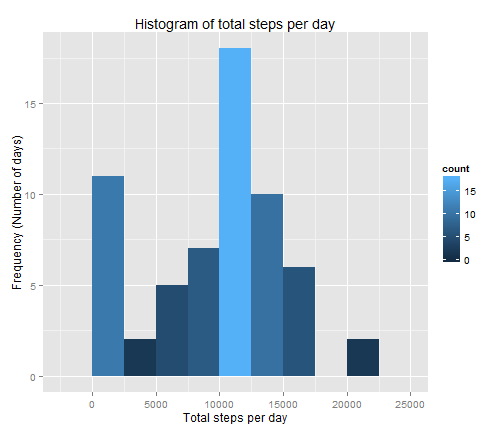
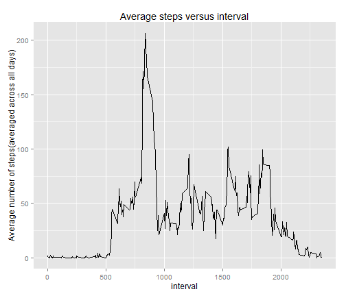
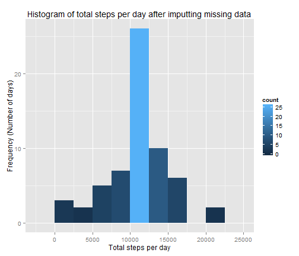
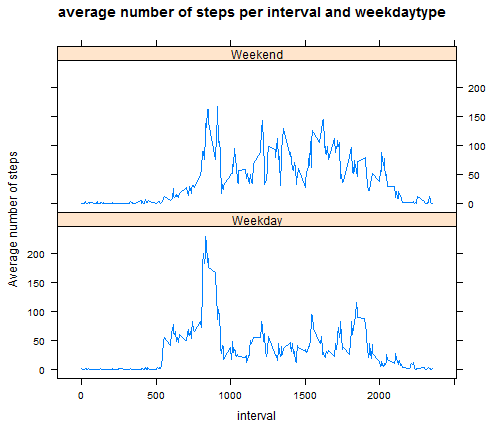

# Reproducible Research: Peer Assessment 1

### Setting global options 

```r
opts_chunk$set(warning=FALSE, fig.height=6,fig.width=7)
options(scipen=1,digits=0)
```

## Loading and preprocessing the data

```r
if(!file.exists("activity.csv"))
  unzip("activity.zip")
activity_data<-read.csv("activity.csv", colClasses=c("numeric", "Date", "numeric"))
```

## What is mean total number of steps taken per day?

```r
library(ggplot2)
library(plyr)
stepsPerDay<-ddply(activity_data,.(date),summarize, total=sum(steps,na.rm=TRUE))
g<-ggplot(na.omit(stepsPerDay),aes(total,fill=..count..)) + geom_histogram(position="identity",binwidth=2500) + xlab("Total steps per day") + ylab("Frequency (Number of days)") + ggtitle("Histogram of total steps per day")
print(g)
```

 

```r
mean_totalsteps<-mean(stepsPerDay$total,na.rm=TRUE)
mean_totalsteps
```

```
## [1] 9354
```

```r
median_totalsteps<-median(stepsPerDay$total,na.rm=TRUE)
median_totalsteps
```

```
## [1] 10395
```

### *Mean and median of total number of steps taken per day are respectively:  9354, 10395*

## What is the average daily activity pattern?

```r
average_steps<-ddply(activity_data,.(interval),summarize, average=mean(steps,na.rm=TRUE))
qplot(interval,average,data=average_steps,geom="line")+ labs(title="Average steps versus interval")+ylab("Average number of steps(averaged across all days)")
```

 

```r
max_avgsteps_interval<-average_steps$interval[which.max(average_steps$average)]
max_avgsteps_interval
```

```
## [1] 835
```

### *The 5-minute interval which contains maximum of average number of steps is: 835*

## Imputing missing values


```r
total_na<-sum(is.na(activity_data))
total_na
```

```
## [1] 2304
```

```r
colsums<-colSums(is.na(activity_data))
colsums
```

```
##    steps     date interval 
##     2304        0        0
```
### *Total number of missing values in the dataset: 2304*    
***Only Steps column has mssing values***
### Strategy for imputting missing data:
 The strategy is to replace missing value of steps with corresponding interval's average step.    
####  Steps of strategy:    
 1. First we have to get a list of all corresponding interval for all missing values of steps.  
 2. Then we have to derive a list of average steps for the corresponding intervals using sapply.   
 3. Then create a copy of original data.    
 4. Then replace the missing value of copied data with the values of list of second step. 
 
**Code for strategy :**

```r
interval_na<-activity_data$interval[is.na(activity_data$steps)]
interval_mean_forna<-sapply(interval_na, function(x) average_steps$average[which(average_steps$interval==x)])
new_activity<-activity_data
new_activity$steps[is.na(activity_data$steps)]<-interval_mean_forna
```
### Histogram for new activity data after imputting missing values

```r
newstepsPerDay<-ddply(new_activity,.(date),summarize, total=sum(steps))

g<-ggplot(newstepsPerDay,aes(total,fill=..count..)) + geom_histogram(position="identity",binwidth=2500) + xlab("Total steps per day") + ylab("Frequency (Number of days)") + ggtitle("Histogram of total steps per day after imputting missing data")
print(g)
```

 

```r
newmean_totalsteps<-mean(newstepsPerDay$total)
newmean_totalsteps
```

```
## [1] 10766
```

```r
newmedian_totalsteps<-median(newstepsPerDay$total)
newmedian_totalsteps
```

```
## [1] 10766
```

### *Mean and median of total number of steps taken per day after imputting missing data are respectively:  10766, 10766*

## Are there differences in activity patterns between weekdays and weekends?

```r
Sys.setlocale("LC_TIME","English")
```

```
## [1] "English_United States.1252"
```

```r
new_activity$weekdaytype <- as.factor(ifelse(weekdays(new_activity$date) %in% c("Saturday","Sunday"),"Weekend", "Weekday"))

newaverage_steps<-ddply(new_activity,.(interval,weekdaytype),summarize, average=mean(steps))
library(lattice)
xyplot(average~interval|weekdaytype,data=newaverage_steps,type="l",layout=c(1,2), ylab="Average number of steps", main="average number of steps per interval and weekdaytype")
```

 
